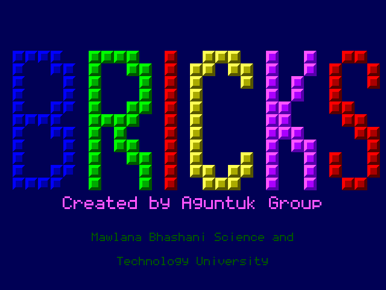
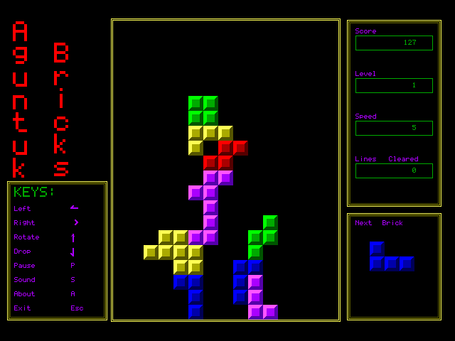
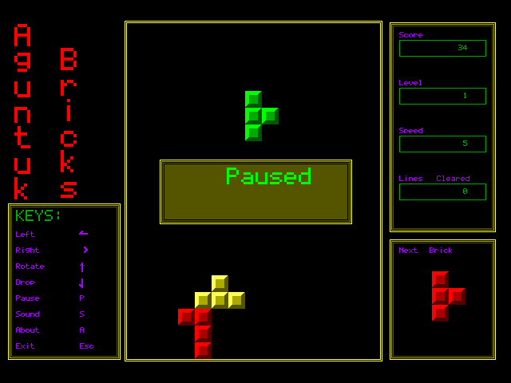

# Aguntuk Bricks

A Tetris clone written as a first year C programming course project (in C++), originally
for Turbo C++ on DOS/Windows using the BGI graphics library. It now builds and runs on
modern macOS and Linux through a small BGI-to-SDL2 compatibility layer, so no DOS
emulator or `GRAPHICS.H` installation is needed.

## Screenshots







## Building and running

The only dependency is SDL2.

```
# macOS
brew install sdl2

# Debian / Ubuntu
sudo apt install libsdl2-dev
```

Then build and play:

```
make run
```

`make` still just builds the `tetris` binary if you want to start it yourself.

## Controls

| Key              | Action                  |
|------------------|-------------------------|
| Left / Right     | Move the falling brick  |
| Up, Enter, Space | Rotate                  |
| Down             | Drop one row (+1 point) |
| P                | Pause                   |
| S                | Toggle sound            |
| A                | About                   |
| Esc              | Quit                    |

Clearing a line scores 100 points, and clearing several lines at once multiplies that.
Every 20 cleared lines raises the level and the falling speed.

## How it works

`tetris.cpp` is the original game: a 15x20 board held in three integer matrices (the
resting bricks, the board including the falling brick, and the previously drawn frame so
only changed cells are repainted), with bricks blitted from sprites captured at startup
via `getimage`.

`graphics_compat.cpp` provides the BGI and `conio` functions the game calls
(`initgraph`, `fillpoly`, `outtextxy`, `getimage`/`putimage`, `kbhit`, `getch`, ...) on
top of SDL2. Everything is drawn into a 640x480 software framebuffer that is uploaded to
the window once per frame, rather than straight to the GPU, because the game uses
`getimage` to read its own sprites back out of video memory. The layer also emulates the
pieces of DOS the game depends on: EGA palette remapping through `setpalette`, a built-in
5x7 bitmap font standing in for the BGI stroked fonts, and keyboard input where extended
keys arrive as a `0` byte followed by a scan code.

## Automated screenshots

The compatibility layer can play the game by itself and save frames, which is handy for
grabbing screenshots without a hand on the keyboard:

    TETRIS_AUTOPLAY=1 TETRIS_SHOT_DIR=/tmp/shots TETRIS_SHOT_MS=600,5000,12000 ./tetris

`TETRIS_AUTOPLAY` injects keypresses, `TETRIS_SHOT_DIR` is where `shot-NN.bmp` files are
written, and `TETRIS_SHOT_MS` is a comma-separated list of capture times in milliseconds
(defaulting to 400, 3000, 7000 and 12000). With autoplay enabled the process exits
shortly after the last capture. Both variables are optional and work independently.

## License

Released under a Creative Commons Non-Commercial license. Everyone is free to use it for
non-commercial purposes.

Thanks.
